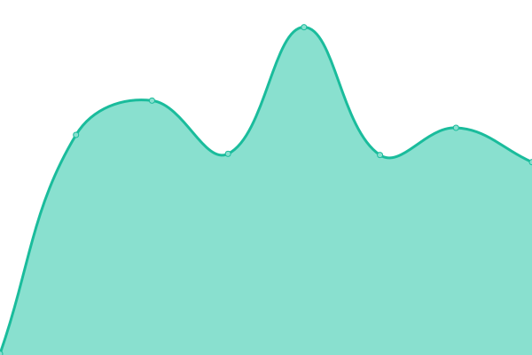
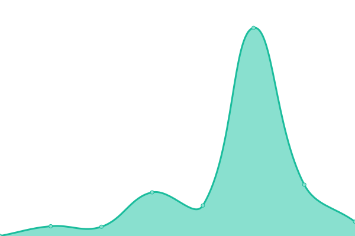
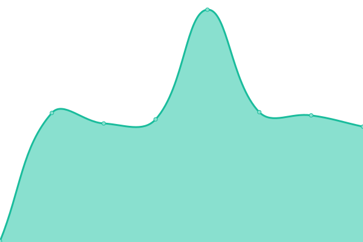

# [📈 Live Status](https://crileiton.github.io/upptime-QB): <!--live status--> **🟧 Partial outage**

This repository contains the open-source uptime monitor and status page for [Cristian Mauricio Leiton Valencia](https://cristianleiton.com), powered by [Upptime](https://github.com/upptime/upptime).

With [Upptime](https://upptime.js.org), you can get your own unlimited and free uptime monitor and status page, powered entirely by a GitHub repository. We use [Issues](https://github.com/crileiton/upptime-QB/issues) as incident reports, [Actions](https://github.com/crileiton/upptime-QB/actions) as uptime monitors, and [Pages](https://crileiton.github.io/upptime-QB) for the status page.

<!--start: status pages-->
<!-- This summary is generated by Upptime (https://github.com/upptime/upptime) -->
<!-- Do not edit this manually, your changes will be overwritten -->
<!-- prettier-ignore -->
| URL | Status | History | Response Time | Uptime |
| --- | ------ | ------- | ------------- | ------ |
|  QB-Dev | 🟩 Up | [qb-dev.yml](https://github.com/crileiton/upptime/commits/HEAD/history/qb-dev.yml) | 

 197ms
     
 | 

<a href="https://crileiton.github.io/upptime/history/qb-dev">100.00%</a>
    

|  QB-QA | 🟩 Up | [qb-qa.yml](https://github.com/crileiton/upptime/commits/HEAD/history/qb-qa.yml) | 

 9377ms
     
 | 

<a href="https://crileiton.github.io/upptime/history/qb-qa">26.68%</a>
    

|  QB-Production | 🟩 Up | [qb-production.yml](https://github.com/crileiton/upptime/commits/HEAD/history/qb-production.yml) | 

 445ms
     
 | 

<a href="https://crileiton.github.io/upptime/history/qb-production">100.00%</a>
    

|  PW-Dev | 🟩 Up | [pw-dev.yml](https://github.com/crileiton/upptime/commits/HEAD/history/pw-dev.yml) | 

 218ms
     
 | 

<a href="https://crileiton.github.io/upptime/history/pw-dev">100.00%</a>
    

|  PW-QA | 🟩 Up | [pw-qa.yml](https://github.com/crileiton/upptime/commits/HEAD/history/pw-qa.yml) | 

 209ms
     
 | 

<a href="https://crileiton.github.io/upptime/history/pw-qa">100.00%</a>
    

|  [Test Broken Site 10](https://cdqqqssnnnosasan.com/appleee) | 🟥 Down | [test-broken-site-10.yml](https://github.com/crileiton/upptime/commits/HEAD/history/test-broken-site-10.yml) | 

 0ms
     
 | 

<a href="https://crileiton.github.io/upptime/history/test-broken-site-10">0.00%</a>
    

|  [Personal Page](https://cristianleiton.com) | 🟩 Up | [personal-page.yml](https://github.com/crileiton/upptime/commits/HEAD/history/personal-page.yml) | 

 215ms
     
 | 

<a href="https://crileiton.github.io/upptime/history/personal-page">100.00%</a>
    

|  [Personal Blog](https://blog.cristianleiton.com) | 🟩 Up | [personal-blog.yml](https://github.com/crileiton/upptime/commits/HEAD/history/personal-blog.yml) | 

 706ms
     
 | 

<a href="https://crileiton.github.io/upptime/history/personal-blog">100.00%</a>
    

<!--end: status pages-->

[**Visit our status website →**](https://crileiton.github.io/upptime-QB)

## 📄 License

- Powered by: [Upptime](https://github.com/upptime/upptime)
- Code: [MIT](./LICENSE) © [Cristian Mauricio Leiton Valencia](https://cristianleiton.com)
- Data in the `./history` directory: [Open Database License](https://opendatacommons.org/licenses/odbl/1-0/)
